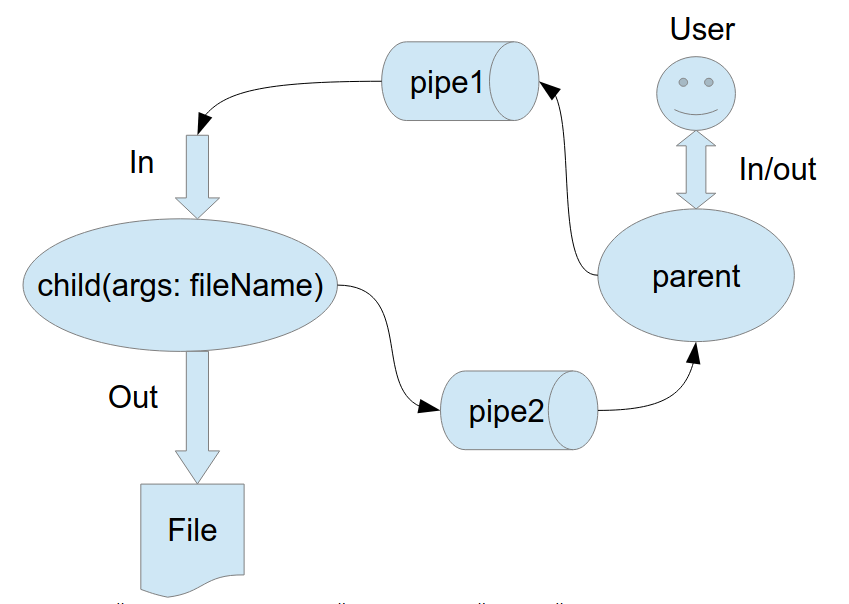

# MAI_OS_3sem2024
Лабораторные работы по предмету "Операционные системы"

# Навигация
- [ЛР 1](https://github.com/Matvey26/MAI_OS_3sem2024/tree/lab1)
- [ЛР 2](https://github.com/Matvey26/MAI_OS_3sem2024/tree/lab2)
- [ЛР 3](https://github.com/Matvey26/MAI_OS_3sem2024/tree/lab3)
- [ЛР 4](https://github.com/Matvey26/MAI_OS_3sem2024/tree/lab4)
- [ЛР 5](https://github.com/Matvey26/MAI_OS_3sem2024/tree/lab5)
- [ЛР 6](https://github.com/Matvey26/MAI_OS_3sem2024/tree/lab6)
- [ЛР 7](https://github.com/Matvey26/MAI_OS_3sem2024/tree/lab7)
- [ЛР 8](https://github.com/Matvey26/MAI_OS_3sem2024/tree/lab8)

# Лабораторная работа №3

## Цель работы

- Приобретение практических навыков в:
  - освоении принципов работы с файловыми системами;
  - обеспечении обмена данных между процессами посредством технологии «File mapping».

## Задание

Составить и отладить программу на языке **Си**, которая выполняет работу с процессами и взаимодействие между ними в одной из двух операционных систем. 

В результате работы программа (основной процесс) должна создать для решения задачи один или несколько дочерних процессов. Взаимодействие между процессами осуществляется через системные сигналы/события и/или через отображаемые файлы (*memory-mapped files*). Необходимо также обрабатывать системные ошибки, которые могут возникнуть в процессе работы.

### Общее описание задачи 

Родительский процесс создает дочерний процесс.

Первой строчкой пользователь в консоль родительского процесса пишет имя файла, которое будет передано при создании дочернего процесса.

Родительский и дочерний процесс должны быть представлены разными программами.

Родительский процесс передает команды пользователя через pipe1, который связан с стандартным входным потоком дочернего процесса.

Дочерний процесс при необходимости передает данные в родительский процесс через pipe2.

Результаты своей работы дочерний процесс пишет в созданный им файл. Допускается просто открыть файл и писать туда, не перенаправляя стандартный поток вывода.

### Вариант №1

Пользователь вводит команды вида: «число число число<endline>». Далее эти числа передаются от родительского процесса в дочерний. Дочерний процесс считает их сумму и выводит её в файл. Числа имеют тип int. Количество чисел может быть произвольным

## Запуск программы

Выполните `./run.sh` в терминале (если у вас линукс, конечно)